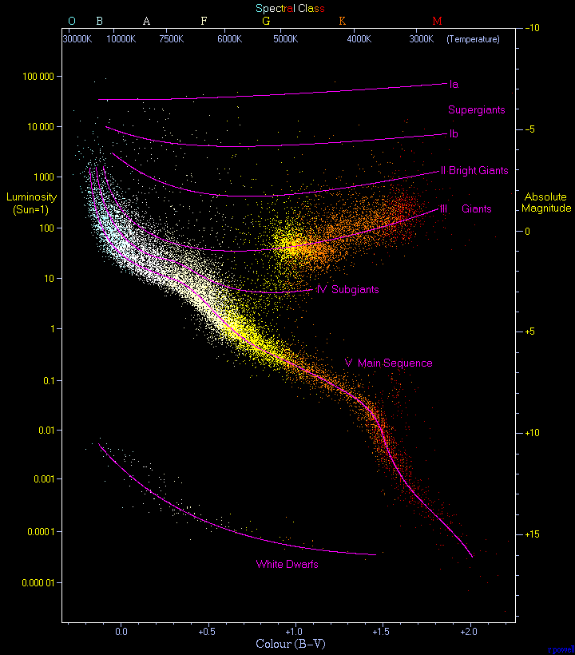
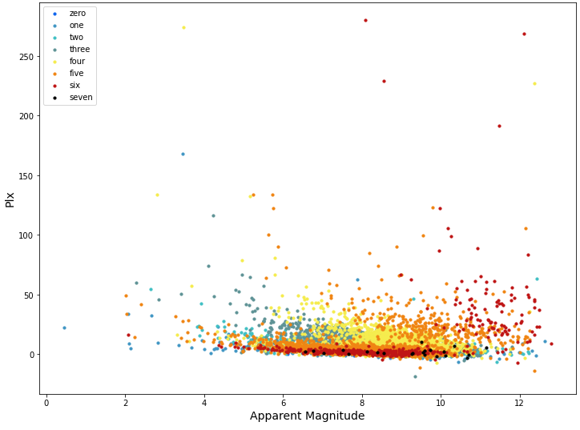
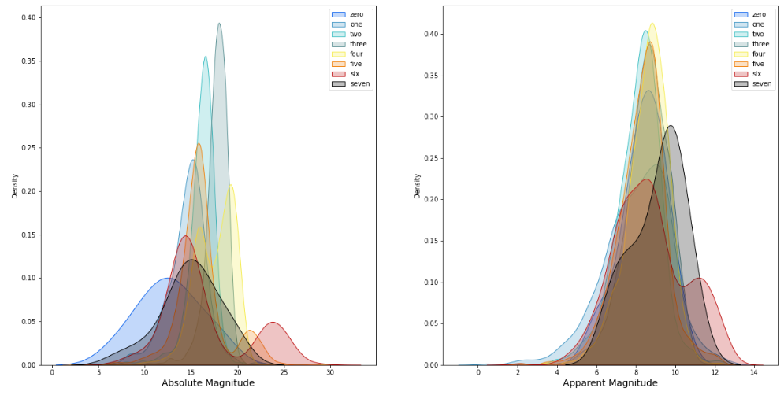
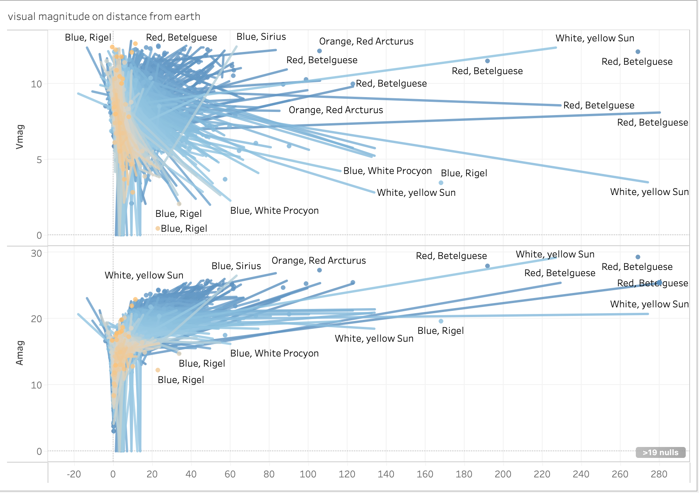

# Project-4

## Team: Cheila, Grace, Helen, Jacob, Kassem & Rami

## Project Title: STARS ANALYSIS

For our 4th project we’ve decided to create a Machine Learning Model that can help classify stars into their respective categories. 

Firstly, after deciding the members of our group and getting together we looked at  various data sets across various topic categories mainly used Kaggle & google searches to find our dataset.

We came to a general group consensus on our final dataset related to “star dataset for stellar classification” (star-categorization-giants-and-dwarfs). 

So this will be the problem/topic we wanted to analyse and visualise.

We were either going to choose supervised or unsupervised machine learning and but we deciced ultimately on a supervised machine learning route due to the classification requirements our models would need to meet. Two models were built based off of different information within the original dataset, one is Random Forest Classifier and the other is Support Vector Machine.

### Libraries used: 
* SkLearn
* ImbLearn
* MatPlotLib
* Seaborn
* Plotly
* Collections
* SqlAlchemy 
* NumPy 
* Pandas 
* Warnings 

We also included two Tableau dashboards to analyse our datasets. 

## Aim

The aim of this study is to utilise the Morgan-Keenan (MK) classification system, which incorporates the HR classification system, to categorise stars by their chromaticity and size using spectral data. The study will focus on categorising stars into the main Spectral Types using the Absolute Magnitude and B-V Color Index within a specific dataset.

## Dataset

[Kaggle Dataset - Star Dataset for Stellar Classification](https://www.kaggle.com/datasets/vinesmsuic/star-categorization-giants-and-dwarfs)  
[Star Data - Raw Small](Resources/Star9999_raw.csv) and [Star Data- Raw Large](Resources/Star99999_raw.csv)

For Tableau we used two slightly different datasets, one with a target column name and one without, to allow for different visualisations, one that tells more of a story and one more for numerical analysis. They can be found [here](Resources/final_stars.csv) and [here](Resources/TG_stars_database.csv) 

For our Supervised Learning Models we used two different datasets as we had two different classification models. One was based on a sample size of 10,000 and the other off a sample size of 100,000, both datasets were cleaned the same way but preprocessed slightly differently They can be found [here](Resources/TG_stars.csv) and [here](Resources/PreProcess_2Targets_beforeDownSample.csv)

## Spectral Star Type

## Spectral Class

## ETL - Extract, Transform and Load Process

Considering the complexity of different databases, and in order to bring only the relevant data to be analysed, this project implements an **ETL 
process**, which was implemented using Jypyter notebook, SQLAlchemy and **Pandas DataFrame**. 
 
## Extract

Firstly, this process extracts the data from the CSV files using Pandas DataFrame. In the extraction phase, the unwanted columns were removed.

## Transformation

In the Transformation Phase, columns were added to the DataFrame creating additional column:

 * `A Mag`: this was needed to classify the stars but to get this figure we needed to calculate it by running the calculation from the dataset **Vmag x Plx** absolute magnitude to help us seperate stellar classes by grouping based on this variable.  
 * `class target`: This was a conversion from Spectral Type, so a for loop was used to categorise the stars based on some defined critiria which we have shown in the spectral star type visual.  
 * `star classification`: we created this column for our tableau visuals.  

## Load

The last phase of the ETL process to save the data in a proper database, so it can be easily loaded by another application to proceed with further analysis on the data. We did this in the Jypeter Notebook `Connect_to_Database.ipynb`.

This process has prepared CSV files with clean data, which are available in the `/Resources` folder of this repository.

Finally, and very importantly, a **Postgres Database** was created (`/Resources/Connect_to_Database.ipynb`), and the consolidated data loaded into the table. `TG_stars_database.csv` & `TG_stars.csv`.

## Preprocessing

During the preprocessing part of the project we essentially cleaned our data by correcting the datatypes from 'object' to 'float'. After this we were able to remove any rows with Null values, this created a loss of 3.2% of the data, which is an acceptable loss.

After this was completed we needed to calculate Absolute Magnitude using the below equation. 

We were then able to create our 'TargetClass' Column, which utlised a for loop to separate the Spectral Types from 'O' to 'M' into their respective classes.

Finally, we dropped the 'SpType' Column to allow for a completely numerical and scalable dataframe. 

This preprocessed CSV has been saved as TG_stars. This is the fully preprocessed dataset from which we worked. 

## Data Model Implementation
When we are training and testing the model we had to separate the data into two models and data sets.

So that we were not cheating the models as if we tested the whole model and dataset we’ve would seen what we want from the training model and we would 
be testing the same in the test set model in the final optimised model.

So by splitting the datasets and looping through the numbers on the labels we would be training on one set of data and then test on the next set of data 
after making our predictions.
We have produced a Python script that initializes, trains, and evaluates a model based on our cleaned up dataset which is the `Final_Stars.csv`.

The cleaned, normalized, and standardized data was achieved as part of our pre-processing work at the begining of the project and prior to modeling. 
This is evidenced under the `resources` files starting with `Star9999_raw` then further formating within the `Clean_stars.csv` and lastly leading to our 
final `Final_Stars.csv` which is our fully formatted and cleaned dataset file.

The Model utilizes data retrieved from SQL which is visable iwithin out Jupeter Notebook script.

The model demonstrates meaningful predictive power of over the 75% threshold set within the rubric at 75.10% classification accuracy. It becasue of the 
for loop in the pre processing that cleaned the target class to give us a higher classification accuracy.

## Data Model Optimization

Then we ran the model optimization and evaluation process by making iterative changes to the model and the resulting changes in model performance is 
documented at slightly higher to 75.6% this is within the Python script itself.

Overall model performance is printed or displayed at the end of the script as mentioned is at 75.6% post the model optimisation process.

Within the two-target folder is our final optimised model and analysis which contains an accuracy of 89.2%. 

##  Tableau & Visualisations

For our visualisations we used **Matplotlib and Seaborn** this is because our data was to present density related data of the stellar bodies.

### Tableau Visuals

[Stars Tableau Dashboard 1](https://public.tableau.com/app/profile/rahmi.rahmiev/viz/StellarDashboard/Dashboard1)  

[Stars Tableau Dashboard 2](https://public.tableau.com/app/profile/grace.cheuk/viz/StellarClassification_16764912311040/Dashboard1?publish=yes) 

 

