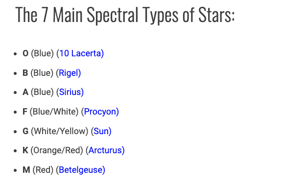
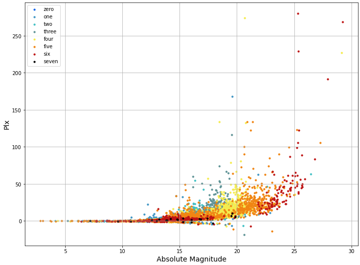
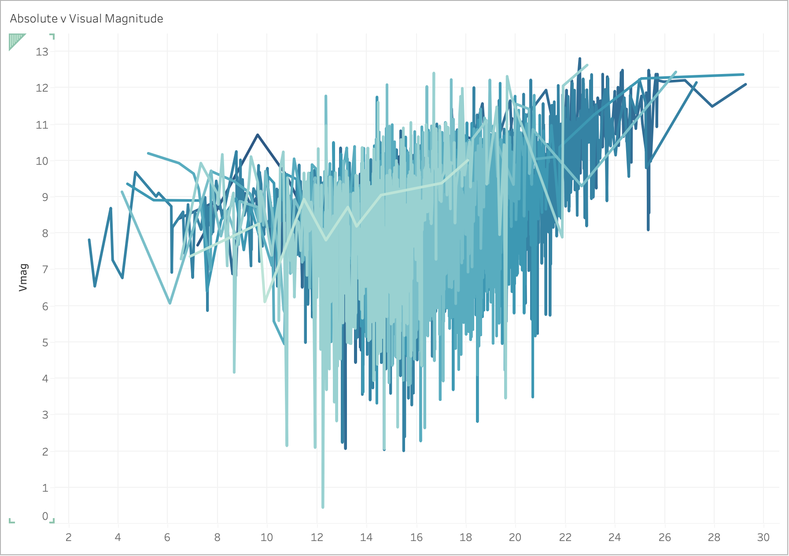

# Project-4

## Team: Cheila, Grace, Helen, Jacob, Kassem & Rami

## Project Title: STARS ANALYSIS

For our 4th project we’ve decided to look at and analyse data relating to star’s. 

Firstly after deciding the members of our group and getting together we looked at  various data sets across various topic categories mainly used Kaggle & google searches to find our dataset.

We came to a general group consensus on our final dataset related to “star dataset for stellar classification” (star-categorization-giants-and-dwarfs). 

So this will be the problem/topic we wanted to analyse and visualise.

Next in our group we looked at deciding if we should do supervised or unsupervised machine learning at the moment we are leaning toward unsupervised 
machine learning. And we will also be using Scikit-learn as the main library to import well as other machine learning such as random forest possibly.

Also decided what of the following programming language we wanted to use such as panda’s, python matplotlib as well as Tableau to create a dashboard to 
showcase our data in a nice final visualisation.

## Aim

The aim of this study is to utilise the Morgan-Keenan (MK) classification system, which incorporates the HR classification system, to categorise stars by their chromaticity and size using spectral data. The study will focus on categorising stars into the main Spectral Types using the Absolute Magnitude and B-V Color Index within a specific dataset.

## Dataset

[Kaggle Dataset - Star Dataset for Stellar Classification](https://www.kaggle.com/datasets/vinesmsuic/star-categorization-giants-and-dwarfs)  
[Stars Data - Raw](Resources/Star9999_raw.csv)   
[Stars Data - Clean](Resources/clean_stars.csv)  
[Stars Data - Final](Resources/final_stars.csv)

## Spectral Star Type

## ETL - Extract, Transform and Load Process

Considering the complexity of different databases, and in order to bring only the relevant data to be analysed, this project implements an **ETL 
process**, which was implemented using Jypyter notepad and **Pandas DataFrame**. 
 
## Extract

Firstly, this process extracts the data from the CSV files using Pandas DataFrame. In the extraction phase, the unwanted columns were removed.

## Transformation

In the Transformation Phase, columns were added to the DataFrame creating additional columb:

 * `A Mag`: this was needed to classify the stars but to get this figure we needed to calculate it by running the calculation from the dataset **Vmag x Plx** absolute magnitude to help us seperate sellar classes by grouping based on this variable.  
 * `class target`: This was a conversion from Spectral Type, so a for loop to categorise the stars based on some defined critiria which we have shown in the spectral star type visual.  
 * `star classification`: we created this column for our tableau visuals.  

## Load

The last phase of the ETL process to save the data in a proper database, so it can be easily loaded by another application to proceed with further analysis on the data. We did this in the Jypeter Notebook `Connect_to_Database.ipynb`.

This process has prepared CSV files with clean data, which are available in the `/Resources` folder of this repository.

Finally, and very importantly, a **Postgres Database** was created (`/Resources/Connect_to_Database.ipynb`), and the consolidated data loaded into the table. `TG_stars_database.csv` & `TG_stars.csv`.

## Preprocessing

During the preprocessing part of the project we took 2 our of our total 10 data sections and used this for the testing and training of the model ran 
this within python.

When we are training and testing the model we had to separate the data into two models and data sets.

So that we were not cheating the models as if we tested the whole model and dataset we’ve would seen what we want from the training model and we would 
be testing the same in the test set model in the final optimised model.

So by splitting the datasets and looping through the numbers on the labels we would be training on one set of data and then test on the next set of data 
after making our predictions.

## Data Model Implementation

We have produced a Python script that initializes, trains, and evaluates a model based on our cleaned up dataset which is the `Final_Stars.csv`.

The cleaned, normalized, and standardized data was achieved as part of our pre-processing work at the begining of the project and prior to modeling. 
This is evidenced under the `resources` files starting with `Star9999_raw` then further formating within the `Clean_stars.csv` and lastly leading to our 
final `Final_Stars.csv` which is our fully formatted and cleaned dataset file.

The Model utilizes data retrieved from SQL which is visable iwithin out Jypeter Notebook script.

The model demonstrates meaningful predictive power of over the 75% threshold set within the rubric at 75.10% classification accuracy. It becasue of the 
for loop in the pre processing that cleaned the target class to give us a higher classification accuracy.

## Data Model Optimization

Then we ran the model optimization and evaluation process by making iterative changes to the model and the resulting changes in model performance is 
documented at slightly higher to 75.6% this is within the Python script itself.

Overall model performance is printed or displayed at the end of the script as mentioned is at 75.6% post the model optimisation process.

Within the two-target folder is our final optimised model and analysis which contains an accuracy of 89.2%. 

##  Tableau & Visualisations

For our visualisations we used **Matplotlib and Seaborn** this is because our data was to present density related data of the stellar bodies.

### Tableau Visuals

[Stars Tableau Dashboard 1](https://public.tableau.com/app/profile/rahmi.rahmiev/viz/StellarDashboard/Dashboard1)  

[Stars Tableau Dashboard 2](https://public.tableau.com/app/profile/grace.cheuk/viz/StellarClassification_16764912311040/Dashboard1?publish=yes) 

 

